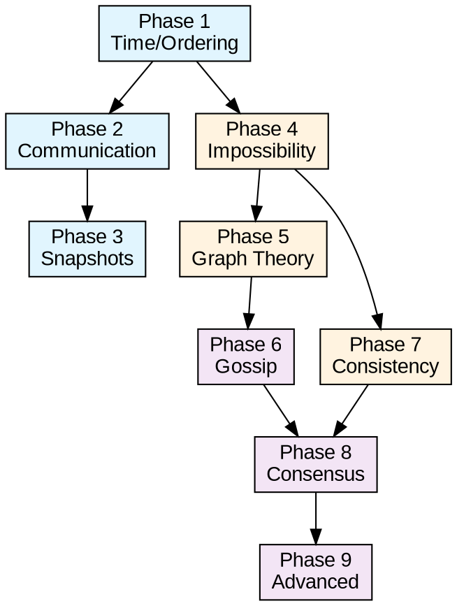

# Distributed Systems Mastery Roadmap
*A comprehensive learning path from fundamentals to advanced research topics*

---

## 🎯 **Learning Philosophy**

This roadmap is designed around the principle that **distributed systems are fundamentally about coordination in the presence of uncertainty**. Each concept builds upon previous ones, creating a coherent understanding of how systems achieve correctness, performance, and fault tolerance when components are physically separated and communication is unreliable.

The progression moves from:
- **Local reasoning** → **Global properties**
- **Perfect systems** → **Fault-tolerant systems**  
- **Deterministic protocols** → **Probabilistic algorithms**
- **Theory** → **Practice**

---

## 📚 **Phase 1: Foundational Concepts**
*Essential building blocks - understand these deeply before proceeding*

### **1.1 Time and Ordering** 
*The fundamental challenge: ordering events without global time*

**📖 Core Paper:**
- **Lamport, L.** (1978). "Time, Clocks, and the Ordering of Events in a Distributed System." *Communications of the ACM*, 21(7), 558-565.
  - **Why it matters:** This is the Genesis paper of distributed systems. Every other concept builds on the happened-before relation.
  - **Key insights:** Logical time, causal relationships, the impossibility of perfect simultaneity

**📚 Supporting Material:**
- Lamport's original website: https://lamport.azurewebsites.net/pubs/time-clocks.pdf
- **Learning objectives:** Understand why "now" doesn't exist in distributed systems, implement Lamport timestamps

**🔬 Modern Research Extensions:**

**Hybrid Logical Clocks (2014-Present):**
- **Kulkarni, S., Demirbas, M., et al.** (2014). "Logical Physical Clocks and Consistent Snapshots in Globally Distributed Databases." *SSS 2014*.
  - **Key insight:** Combines logical causality with physical time proximity - gets benefits of both approaches
  - **Real impact:** Used in CockroachDB, MongoDB, and other production systems
  - **Connection:** Solves the "divorce from physical time" problem that pure logical clocks have

**Google's TrueTime (2012-Present):**
- **Corbett, J., Dean, J., et al.** (2012). "Spanner: Google's Globally-Distributed Database." *OSDI*.
- **Corbett, J., et al.** (2017). "Spanner, TrueTime and the CAP Theorem." *Google Research*.
  - **Key insight:** Uses GPS + atomic clocks to provide globally consistent timestamps with bounded uncertainty
  - **Real impact:** Enables external consistency in globally distributed transactions
  - **Connection:** Shows what's possible with specialized hardware - the "gold standard" for distributed time

**Recent Time Synchronization Research (2020+):**
- **Network Evolution:** Studies on achieving nanosecond-level synchronization in datacenters using advanced PTP implementations
- **Industrial Applications:** Time-sensitive networking (TSN) standards for real-time industrial systems
- **Causal Consistency at Scale:** MongoDB's implementation of cluster-wide logical clocks for causal consistency (2024)

**🔗 Modern Connections:**
- **HLC → MVCC:** Hybrid clocks enable multi-version concurrency control in distributed databases
- **TrueTime → Consensus:** Shows how precise time can eliminate some coordination overhead
- **TSN → Edge Computing:** Modern applications in IoT and Industry 4.0 requiring microsecond coordination

### **1.2 Physical Time Synchronization**
*When you actually need wall-clock time*

**📖 Core Papers:**
- **Cristian, F.** (1989). "Probabilistic Clock Synchronization." *Distributed Computing*, 3(3), 146-158.
  - **Key insight:** Simple request-response model for clock sync, but accuracy depends on network RTT
  - **Limitation:** Single point of failure, works best in low-latency networks
- **Mills, D.** (1991). "Internet Time Synchronization: The Network Time Protocol." *IEEE Transactions on Communications*, 39(10), 1482-1493.
  - **Key insight:** Hierarchical time distribution, statistical filtering of network delays
  - **Impact:** Foundation of Internet timekeeping, billions of devices worldwide

**🔬 Modern Research Extensions:**

**Precision Time Protocol (PTP/IEEE 1588):**
- **IEEE 1588-2008** "Standard for a Precision Clock Synchronization Protocol" - PTPv2
- **IEEE 1588-2019** "Precision Time Protocol v2.1" - Latest standard with security enhancements
  - **Key advancement:** Hardware timestamping achieves sub-microsecond accuracy vs NTP's millisecond accuracy
  - **Real impact:** Used in financial trading, industrial automation, 5G networks, power grids
  - **Connection:** Where NTP provides "good enough" sync (10ms), PTP provides "precise" sync (1μs)

**Network Time Security (NTS) - 2020:**
- **RFC 8915** "Network Time Security for the Network Time Protocol"
  - **Key insight:** Adds cryptographic authentication to NTP without destroying performance
  - **Modern necessity:** Prevents time-based attacks in critical infrastructure
  - **Implementation:** Supported by Chrony, NTPsec, ntpd-rs (Rust implementation)

**Recent Improvements (2020+):**
- **Hardware Integration:** Network cards with built-in PTP timestamping (Intel, Broadcom chips)
- **Security Research:** Protection against GPS spoofing and NTP amplification attacks  
- **Industrial Applications:** Time-Sensitive Networking (TSN) for Industry 4.0 requiring microsecond sync
- **Memory Safety:** ntpd-rs - Rust implementation of NTP for security-critical environments
- **Quantum-Enhanced Sync:** Research on using quantum entanglement for ultra-precise global time

**🔗 Modern Connections:**
- **NTP → Web Infrastructure:** Still powers most web servers and cloud systems
- **PTP → Real-time Systems:** Critical for 5G, autonomous vehicles, smart grids
- **HLC ↔ PTP:** Hybrid logical clocks often use PTP as their physical time source
- **Security Integration:** Modern time sync requires cryptographic protection against attacks

**💡 Research Evolution:** The field moved from "getting approximate time" (NTP) to "getting precise time" (PTP) to "getting secure precise time" (NTS, authenticated PTP). Current research focuses on quantum-enhanced synchronization and zero-trust time distribution.

### **1.3 Vector Clocks**
*Precise causal tracking*

**📖 Core Paper:**
- **Mattern, F.** (1989). "Virtual Time and Global States of Distributed Systems." *Parallel and Distributed Algorithms*, 215-226.

### **1.4 Hybrid Approaches** 
*Bridging logical and physical time*

**📖 Core Papers:**
- **Kulkarni, S., Demirbas, M., Madappa, D., et al.** (2014). "Logical Physical Clocks and Consistent Snapshots in Globally Distributed Databases." *SSS 2014*.
- **Corbett, J., Dean, J., Epstein, M., et al.** (2012). "Spanner: Google's Globally-Distributed Database." *OSDI*.

**📚 Implementation Examples:**
- **CockroachDB HLC implementation:** https://github.com/cockroachdb/cockroach (HLC timestamps)
- **MongoDB causal consistency:** ClusterTime implementation using HLC principles

**🔗 Connection:** These systems show how to get the benefits of logical clocks (causality) and physical clocks (real-time correlation) simultaneously. They're essential for modern distributed databases.

**💡 Research Insight:** The gap between theory (pure logical time) and practice (need for real timestamps) drove this innovation. Shows how real systems drive theoretical advances.

---

## 📚 **Phase 2: Communication Primitives**
*Building reliable communication from unreliable channels*

### **2.1 Reliable Broadcast**
*Making sure everyone gets the message*

**📖 Core Papers:**
- **Hadzilacos, V. & Toueg, S.** (1994). "A Modular Approach to Fault-Tolerant Broadcasts and Related Problems." Technical Report TR94-1425, Cornell University.
- **Chandra, T. & Toueg, S.** (1996). "Unreliable Failure Detectors for Reliable Distributed Systems." *Journal of the ACM*, 43(2), 225-267.

**🔗 Connection:** Builds on ordering concepts to ensure not just delivery, but *consistent* delivery across all processes.

### **2.2 Causal and Total Order Broadcast**
*When message order matters*

**📖 Core Papers:**
- **Birman, K. & Joseph, T.** (1987). "Reliable Communication in the Presence of Failures." *ACM Transactions on Computer Systems*, 5(1), 47-76.
- **Défago, X., Schiper, A. & Urbán, P.** (2004). "Total Order Broadcast and Multicast Algorithms: Taxonomy and Survey." *ACM Computing Surveys*, 36(4), 372-421.

**🔗 Connection:** Vector clocks enable causal broadcast; total order requires consensus (foreshadowing Phase 4).

---

## 📚 **Phase 3: Global State and Snapshots**
*Understanding the system as a whole*

### **3.1 Distributed Snapshots**
*Capturing consistent global states*

**📖 Core Paper:**
- **Chandy, K.M. & Lamport, L.** (1985). "Distributed Snapshots: Determining Global States of Distributed Systems." *ACM Transactions on Computer Systems*, 3(1), 63-75.
  - **Why it matters:** First algorithm to capture global state without stopping the system
  - **Key insight:** Using marker messages to create consistent cuts

**📚 Supporting Material:**
- Lamport's version: https://lamport.azurewebsites.net/pubs/chandy.pdf
- **Learning objectives:** Implement the algorithm, understand consistent cuts vs. inconsistent cuts

**🔗 Connection:** Direct application of Lamport's happened-before relation. The "straightforward application" Lamport mentioned.

---

## 📚 **Phase 4: The Impossibility Results**
*Understanding the fundamental limits*

### **4.1 FLP Impossibility**
*The most important negative result in distributed systems*

**📖 Core Paper:**
- **Fischer, M.J., Lynch, N.A. & Paterson, M.S.** (1985). "Impossibility of Distributed Consensus with One Faulty Process." *Journal of the ACM*, 32(2), 374-382.
  - **Why it matters:** Proves that perfect consensus is impossible in asynchronous systems
  - **Key insight:** There always exists a "critical" execution that prevents termination

**📚 Supporting Material:**
- MIT's copy: https://groups.csail.mit.edu/tds/papers/Lynch/jacm85.pdf
- Excellent explanation: https://www.the-paper-trail.org/post/2008-08-13-a-brief-tour-of-flp-impossibility/

**🔗 Connection:** This is why all the previous work on broadcast and snapshots was possible - they don't require consensus!

### **4.2 Byzantine Generals Problem**
*The fundamental impossibility with malicious failures*

**📖 Core Papers:**
- **Pease, M., Shostak, R. & Lamport, L.** (1980). "Reaching Agreement in the Presence of Faults." *Journal of the ACM*, 27(2), 228-234.
- **Lamport, L., Shostak, R. & Pease, M.** (1982). "The Byzantine Generals Problem." *ACM Transactions on Programming Languages and Systems*, 4(3), 382-401.

**📚 Supporting Material:**
- Lamport's website: https://lamport.azurewebsites.net/pubs/byz.pdf

**🔗 Connection:** Shows that Byzantine consensus requires n ≥ 3f + 1 processes to tolerate f failures. Complements FLP by showing limits under stronger failure assumptions.

---

## 📚 **Phase 5: Graph Theory Foundations**
*Understanding network structure and routing*

### **5.1 Distributed Spanning Trees**
*Building structure in networks*

**📖 Core Paper:**
- **Gallager, R.G., Humblet, P.A. & Spira, P.M.** (1983). "A Distributed Algorithm for Minimum-Weight Spanning Trees." *ACM Transactions on Programming Languages and Systems*, 5(1), 66-77.

**🔗 Connection:** Many distributed algorithms require underlying tree structures for efficient communication.

### **5.2 Distributed Hash Tables**
*Structured peer-to-peer systems*

**📖 Core Papers:**
- **Stoica, I., Morris, R., Karger, D., et al.** (2001). "Chord: A Scalable Peer-to-peer Lookup Service for Internet Applications." *ACM SIGCOMM*.
- **Maymounkov, P. & Mazières, D.** (2002). "Kademlia: A Peer-to-peer Information System Based on the XOR Metric." *IPTPS*.

**🔗 Connection:** DHTs solve routing and load balancing using consistent hashing and graph-theoretic properties.

---

## 📚 **Phase 6: Gossip Protocols**
*Probabilistic information dissemination*

### **6.1 Epidemic Algorithms**
*Information spreading like diseases*

**📖 Core Papers:**
- **Demers, A., Greene, D., Hauser, C., et al.** (1987). "Epidemic Algorithms for Replicated Database Maintenance." *ACM PODC*.
- **Pittel, B.** (1987). "On Spreading a Rumor." *SIAM Journal on Applied Mathematics*, 47(1), 213-223.

**🔗 Connection:** Uses probabilistic analysis and random graph theory to achieve eventual consistency.

### **6.2 Membership and Failure Detection**
*Who's in the system?*

**📖 Core Papers:**
- **Das, A., Gupta, I. & Motivala, A.** (2002). "SWIM: Scalable Weakly-consistent Infection-style Process Group Membership Protocol." *IEEE DSNET*.
- **Leitão, J., Pereira, J. & Rodrigues, L.** (2007). "HyParView: a Membership Protocol for Reliable Gossip-based Broadcast." *IEEE DSN*.

**🔗 Connection:** Builds on epidemic algorithms to maintain dynamic group membership.

---

## 📚 **Phase 7: Consistency Models**
*Defining what "correct" means*

### **7.1 Sequential and Causal Consistency**
*Relaxed consistency models*

**📖 Core Papers:**
- **Lamport, L.** (1979). "How to Make a Multiprocessor Computer That Correctly Executes Multiprocess Programs." *IEEE Transactions on Computers*, C-28(9), 690-691.
- **Ahamad, M., Neiger, G., Burns, J.E., et al.** (1995). "Causal Memory: Definitions, Implementation, and Programming." *Distributed Computing*, 9(1), 37-49.

**🔗 Connection:** Causal consistency directly uses vector clocks; sequential consistency relates to total order broadcast.

### **7.2 Eventual Consistency and CRDTs**
*Convergence without coordination*

**📖 Core Papers:**
- **Shapiro, M., Preguiça, N., Baquero, C. & Zawirski, M.** (2011). "Conflict-Free Replicated Data Types." *SSS*.
- **Bailis, P. & Ghodsi, A.** (2013). "Eventual Consistency Today: Limitations, Extensions, and Beyond." *ACM Queue*, 11(3).

**🔗 Connection:** Resolves the FLP impossibility by giving up strong consistency - shows how to achieve convergence without consensus.

---

## 📚 **Phase 8: Advanced Consensus**
*Practical solutions despite impossibility*

### **8.1 Paxos Family**
*The classic consensus algorithm*

**📖 Core Papers:**
- **Lamport, L.** (1998). "The Part-Time Parliament." *ACM Transactions on Computer Systems*, 16(2), 133-169.
- **Lamport, L.** (2001). "Paxos Made Simple." *ACM SIGACT News*, 32(4), 18-25.

**📚 Supporting Material:**
- Lamport's website: https://lamport.azurewebsites.net/pubs/paxos-simple.pdf

**🔗 Connection:** Shows how to achieve consensus despite FLP by assuming eventual synchrony and majority availability.

### **8.2 Modern Consensus**
*Practical alternatives*

**📖 Core Papers:**
- **Ongaro, D. & Ousterhout, J.** (2014). "In Search of an Understandable Consensus Algorithm." *USENIX ATC*. (Raft)
- **Castro, M. & Liskov, B.** (1999). "Practical Byzantine Fault Tolerance." *OSDI*.

**🔗 Connection:** Raft simplifies Paxos; PBFT makes Byzantine consensus practical.

---

## 📚 **Phase 9: Advanced Topics**
*Cutting-edge research areas*

### **9.1 Self-Stabilization**
*Systems that heal themselves*

**📖 Core Papers:**
- **Dijkstra, E.W.** (1974). "Self-Stabilizing Systems in Spite of Distributed Control." *Communications of the ACM*, 17(11), 643-644.
- **Dolev, S.** (2000). "Self-Stabilization." *MIT Press* (Book).

### **9.2 Dynamic Networks**
*Handling churn and mobility*

**📖 Core Papers:**
- **Kuhn, F., Lynch, N. & Oshman, R.** (2010). "Distributed Computation in Dynamic Networks." *STOC*.
- **Augustine, J., Pandurangan, G., Robinson, P. & Upfal, E.** (2013). "Towards Robust and Efficient Computation in Dynamic Peer-to-Peer Networks." *SODA*.

---

## 🛤️ **Learning Progression Strategy**

### **Phase Dependencies:**

### **For Each Paper:**
1. **Read the abstract and introduction** - Understand the problem
2. **Implement the algorithm** (where possible) - This is crucial for Rust developers
3. **Work through examples** - Create test cases
4. **Connect to previous concepts** - How does it build on what you know?
5. **Identify the key insight** - What's the breakthrough idea?

### **Practical Exercises:**
- **Phase 1-2:** Build a simple chat system with Lamport timestamps
- **Phase 3:** Implement Chandy-Lamport snapshots in your chat system  
- **Phase 4:** Prove why your chat system can't solve consensus
- **Phase 5-6:** Add peer-to-peer discovery using DHT + gossip
- **Phase 7:** Implement different consistency models
- **Phase 8:** Add Raft consensus for coordination
- **Phase 9:** Make your system self-stabilizing

---

## 🎓 **Assessment Milestones**

### **Beginner → Intermediate:**
Can explain why distributed systems are fundamentally different from concurrent systems, implement basic algorithms, understand causality vs. concurrency.

### **Intermediate → Advanced:**  
Can prove impossibility results, design fault-tolerant protocols, understand trade-offs between consistency and availability.

### **Advanced → Research:**
Can identify open problems, propose novel algorithms, prove correctness properties, handle Byzantine failures.

---

## 📖 **Essential Textbooks**
*For deeper understanding*

1. **Lynch, N.A.** (1996). "Distributed Algorithms." *Morgan Kaufmann* - The definitive theoretical treatment
2. **Cachin, C., Guerraoui, R. & Rodrigues, L.** (2011). "Introduction to Reliable and Secure Distributed Programming." *Springer* - Modern practical approach  
3. **Kleppmann, M.** (2017). "Designing Data-Intensive Applications." *O'Reilly* - Practical systems perspective

---

## 🔬 **Research Venues**
*Where the cutting-edge work appears*

- **PODC** - ACM Symposium on Principles of Distributed Computing
- **DISC** - International Symposium on Distributed Computing  
- **OSDI/SOSP** - Systems conferences
- **SIGCOMM/NSDI** - Networking conferences

---

## 🚀 **Current Research Frontiers (2020+)**
*Where the field is heading*

### **Emerging Areas:**
- **Causal Consistency at Scale:** Large-scale implementations in production systems (MongoDB, etc.)
- **Hardware-Software Co-design:** Custom network cards with built-in timestamping (sub-microsecond accuracy)
- **Time-Sensitive Networking (TSN):** IEEE standards for real-time Ethernet in industrial applications
- **Quantum Clock Synchronization:** Theoretical work on using quantum entanglement for global time
- **ML-Assisted Synchronization:** Using machine learning to predict and compensate for clock drift patterns

### **Open Research Problems:**
- **Energy-Efficient Time Sync:** Battery-constrained IoT devices need microsecond accuracy with minimal power
- **Cross-Cloud Coordination:** How to achieve TrueTime-like guarantees across different cloud providers
- **Byzantine Time Synchronization:** Dealing with adversarial attacks on time infrastructure
- **Relativistic Distributed Systems:** Accounting for special relativity in global-scale systems

### **Tools for Staying Current:**
- **PODC/DISC:** Primary venues for theoretical advances
- **OSDI/SOSP:** Systems implementations and evaluations
- **NSDI:** Networking approaches to synchronization
- **Industry Blogs:** CockroachDB, Google Research, Microsoft Research for practical advances

This roadmap represents approximately 2-3 years of dedicated study for a strong systems engineer. The key is to **implement everything** - distributed systems knowledge is experiential, not just theoretical.
